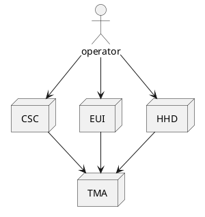
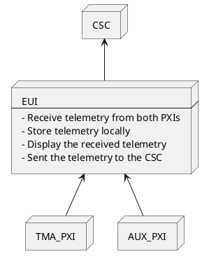
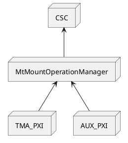

# MCS Operation

| **Requested by:** | **LSST PO** |
| --- | --- |
| **Doc. Code:** | 3151_MCS_0001 |
| **Editor:** | Julen Garcia |
| **Approved by:** | Ismael Ruiz de Argandoña |

## Introduction

This document contains the description of the operation of the Mount Control System (MCS).

## Reference documents

| Document | Code | Version |
| --- | --- | --- |
| Telescope Mount Assembly Baseline Design Document | Document-14411 | 2 |
| Telescope Mount Assembly (TMA) Specifications Document | LTS-103 | 4 |
| TCS to Telescope Mount Interface Control Document | LTS-159 | 6 |
| Observatory Control System Communications Architecture and Protocol (LCSC) | LSE-70 | 1.7 |
| System Dictionary and Telemetry Streams | LSE-74 | 4 |
| LSST Service Abstraction Layer (SAL) software SDK | - | 2.1 |
| Technical Specification. PLCopen - Technical Committee 2 – Task Force. Function blocks for motion control | - | 1.1 |
| DesignConceptsAndTechnologyTalkingPoints | - | - |
| TCS Communication Protocol Interface | LTS-306 | 1.1 |
| TCS Software Component Interface | LTS-307 | 1.2 Draft |

## Interaction with the TMA

There are two ways for interacting with the TMA, using the CSC or the EUI/HHD. The commands allowed for both are the
same, this means that the TMA reacts in the same way for every commander. The only main difference between the EUI/HHD
and the CSC is that the CSC has less commands available for the end user than the EUI/HHD.
Having this in mind, three commanders, systems that can command the TMA, are defined:

- CSC (Commandable SAL Component). Coded by Rubin and designed for observation.
- EUI (Engineering User Interface). Coded by Tekniker as a tool for maintenance and engineering tasks.
- HHD (Hand Held Device). Runs a simplified version of the EUI coded by Tekniker as a tool for maintenance and engineering tasks.



### Managing the commander

There is a command (id: 2103) for changing from one commander to another, this command can be sent at any time to change
the commander, unless the actual commander is the HHD. When the actual commander is the HHD, the command must be
released by the HHD on purpose, this means transferring the command to another commander CSC/EUI.

It is important for the commander, that once the command is obtained, a clock command (id: 3000) must be sent periodically
to keep the system from halting. If the clock command is not sent for more than 5 seconds all the systems that have
possible movements FAULT, this means that they are abruptly stopped to prevent any issues due to the commander loss.
This means that all systems except the temperature controllers, main power supply and OSS are halted (by going to FAULT
state) if the commander stops sending the clock.

### Commands

The commands available for the TMA are described in the [PXI Documentation repo](https://github.com/lsst-ts/ts_tma_tma-documentation_pxi-controller_documentation)
inside the `02 CommandsAndEventsManagement` directory in the `03 Commands.md` file.

For sending these commands a custom protocol over TCP/IP is used, this protocol is defined in the MtMountOperationManager
repo [here](https://gitlab.tekniker.es/aut/projects/3151-LSST/OperationManager/lsst/-/blob/develop/tma_management/doc/protocol.md).

### Telemetry

The telemetry is the data generated in the PXIs that must be stored in the EFD (Rubin data storage system) and MCC. As the
telemetry from the PXIs (TMA and AUX PXIs) is sent using a custom protocol the data is received in the EUI, processed,
displayed, stored locally in the MCC with high resolution and finally sent to the CSC (this is represented in the following
diagram). For defining which telemetry is obtained from the PXIs and which is sent to the CSC, a configuration file is
used. This telemetry configuration file use is explained in the
[HMI Documentation repo](https://github.com/lsst-ts/ts_tma_tma-documentation_hmi-computers_documentation)
inside the `04 TelemetryManagement` directory in the `00 TelemetryManagement.md` file.



The telemetry sent to the CSC is a reduced set of the telemetry stored in the MCC, as defined in the configuration file
mentioned before. This file is divided in topics, that match the topics sent to the CSC, there is one for each subsystem.
The topics sent to the CSC are formatted in JSON as follows:

```json
{
  "topicID": 10,
  "timestamp": 3760503810.74012,
  "definedVariableName0": 0.30,
  "definedVariableName1": 5.24,
  "definedVariableName2": 0.54,
  "definedVariableName3": 5.47,
  "definedVariableName4": 6.03
}
```

- topicID: identifier for the topic (subsystem)
- timestamp: timestamp value for the topic. This timestamp is unique for the topic, therefore it could happen that variables
  inside the topic don't fully match in time, as the PXI sends each variable with a different timestamp value but then
  they are gathered together inside the same topic and timestamped as a whole.
- variable names defined in the configuration file

### Events

The events are defined to inform the CSC of the TMA status, as the boolean and state variables are not sent using the
telemetry, the structure for the events is shown in the diagram below.
All the defined events are explained in the [PXI Documentation repo](https://github.com/lsst-ts/ts_tma_tma-documentation_pxi-controller_documentation)
inside the `02 CommandsAndEventsManagement` directory in the `04 Events.md` file.



The format for each of the events is explained in the document mentioned before, but all follow the same base structure.

```json
{
    "id": 0,
    "timestamp": 3701055564.832080,
    "parameters": {
    }
}
```

- id: identifier for the event
- timestamp: timestamp value for the event
- parameters: json object that contains the event information, is different for each event
